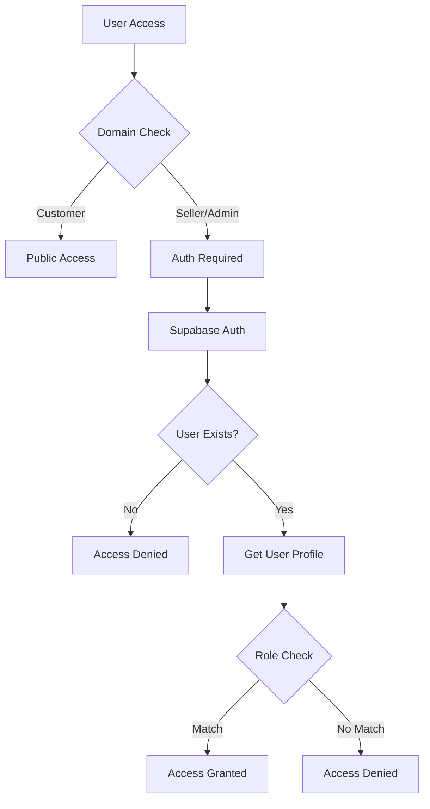
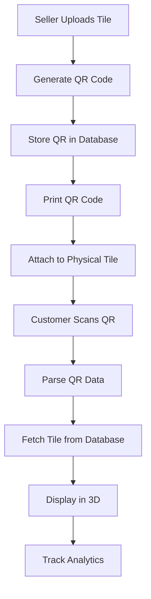
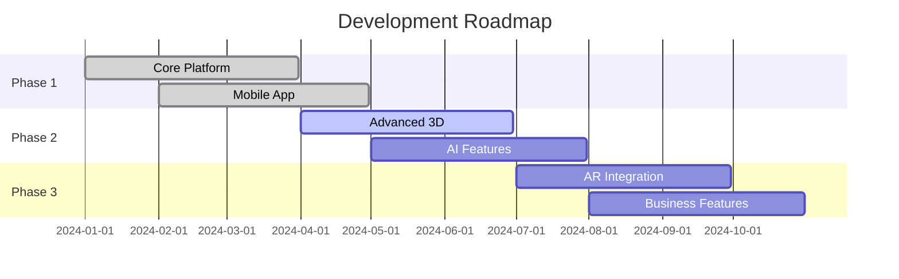

# 🏗️ Tile Showroom 3D - Complete Project Documentation

## 📋 Table of Contents

1. [Project Overview](#project-overview)
2. [Architecture & Technology Stack](#architecture--technology-stack)
3. [Multi-Domain System](#multi-domain-system)
4. [Database Schema](#database-schema)
5. [Authentication & Authorization](#authentication--authorization)
6. [Frontend Components](#frontend-components)
7. [Backend Services](#backend-services)
8. [Mobile Application](#mobile-application)
9. [3D Visualization System](#3d-visualization-system)
10. [QR Code System](#qr-code-system)
11. [Analytics & Tracking](#analytics--tracking)
12. [Deployment & Configuration](#deployment--configuration)
13. [API Documentation](#api-documentation)
14. [Development Workflow](#development-workflow)
15. [Troubleshooting Guide](#troubleshooting-guide)

---

## 🎯 Project Overview

### **What is Tile Showroom 3D?**

Tile Showroom 3D is a comprehensive SaaS platform that revolutionizes how customers experience and purchase tiles. It combines 3D visualization, QR code technology, and multi-tenant architecture to create an immersive tile shopping experience.

### **Key Features**

- **🏠 3D Room Visualization**: Interactive 3D rooms (hall, washroom, kitchen) with real-time tile application
- **📱 QR Code Integration**: Physical-to-digital bridge via QR codes on tiles
- **🏢 Multi-Tenant Architecture**: Separate portals for customers, sellers, and administrators
- **📊 Advanced Analytics**: Comprehensive tracking of tile views, applications, and conversions
- **📱 Mobile App**: React Native app for QR scanning and mobile visualization
- **🔐 Role-Based Access Control**: Secure authentication with seller and admin roles

### **Business Model**

- **SaaS Platform**: Multi-tenant system serving multiple tile sellers
- **B2B2C Model**: Sellers manage inventory, customers browse and visualize
- **Revenue Streams**: Subscription fees, commission-based model, premium features

---

## 🏗️ Architecture & Technology Stack

### **Frontend Architecture**

```
┌─────────────────────────────────────────────────────────────┐
│                    Frontend Layer                           │
├─────────────────────────────────────────────────────────────┤
│  React 18 + TypeScript + Vite                             │
│  ├── Customer Portal (/)                                   │
│  ├── Seller Dashboard (/seller)                           │
│  └── Admin Panel (/admin)                                 │
├─────────────────────────────────────────────────────────────┤
│  State Management: Zustand                                │
│  Styling: Tailwind CSS                                    │
│  3D Graphics: Three.js + React Three Fiber               │
│  Icons: Lucide React                                      │
└─────────────────────────────────────────────────────────────┘
```

### **Backend Architecture**

```
┌─────────────────────────────────────────────────────────────┐
│                    Backend Layer                            │
├─────────────────────────────────────────────────────────────┤
│  Supabase (PostgreSQL + Auth + Real-time)                 │
│  ├── Database: PostgreSQL with RLS                        │
│  ├── Authentication: Supabase Auth                        │
│  ├── Real-time: WebSocket subscriptions                   │
│  └── Storage: File uploads (future)                       │
├─────────────────────────────────────────────────────────────┤
│  Edge Functions (Serverless)                              │
│  ├── QR Code Generation                                   │
│  ├── Analytics Processing                                 │
│  └── External API Integration                             │
└─────────────────────────────────────────────────────────────┘
```

### **Mobile Architecture**

```
┌─────────────────────────────────────────────────────────────┐
│                    Mobile Layer                             │
├─────────────────────────────────────────────────────────────┤
│  React Native + Expo                                      │
│  ├── QR Scanner (Camera integration)                      │
│  ├── 3D Viewer (Three.js mobile)                         │
│  ├── Tile Catalog                                         │
│  └── User Authentication                                  │
├─────────────────────────────────────────────────────────────┤
│  Navigation: React Navigation                             │
│  State: Context API                                       │
│  Storage: AsyncStorage                                    │
└─────────────────────────────────────────────────────────────┘
```

### **Technology Stack Details**

| Layer | Technology | Version | Purpose |
|-------|------------|---------|---------|
| **Frontend** | React | 18.3.1 | UI Framework |
| | TypeScript | 5.5.3 | Type Safety |
| | Vite | 5.4.2 | Build Tool |
| | Tailwind CSS | 3.4.1 | Styling |
| | Three.js | 0.162.0 | 3D Graphics |
| | React Three Fiber | 8.1.0 | React 3D Integration |
| | Zustand | 5.0.8 | State Management |
| **Backend** | Supabase | Latest | BaaS Platform |
| | PostgreSQL | 15+ | Database |
| | PostgREST | Latest | Auto API |
| **Mobile** | React Native | 0.74.5 | Mobile Framework |
| | Expo | 51.0.28 | Development Platform |
| | Three.js | 0.162.0 | Mobile 3D |
| **Development** | Node.js | 16+ | Runtime |
| | npm | Latest | Package Manager |

---

## 🌐 Multi-Domain System

### **Domain Structure**

The platform uses a sophisticated multi-domain architecture that adapts based on URL paths:

```
Production Domains:
├── customers.yourdomain.com  → Customer Portal
├── seller.yourdomain.com     → Seller Dashboard  
└── admin.yourdomain.com      → Admin Panel

Development URLs:
├── localhost:5173/           → Customer Portal
├── localhost:5173/seller     → Seller Dashboard
└── localhost:5173/admin      → Admin Panel
```

### **Domain Configuration**

```typescript
// src/utils/domainUtils.ts
export const DOMAIN_CONFIGS: Record<string, DomainConfig> = {
  'main': {
    domain: 'main',
    userType: 'customer',
    title: 'Tile Showroom - Virtual Showroom',
    theme: { primary: '#2563eb', secondary: '#1e40af', accent: '#3b82f6' }
  },
  'seller': {
    domain: 'seller',
    userType: 'seller',
    title: 'Tile Showroom - Seller Dashboard',
    theme: { primary: '#059669', secondary: '#047857', accent: '#10b981' }
  },
  'admin': {
    domain: 'admin',
    userType: 'admin',
    title: 'Tile Showroom - Admin Panel',
    theme: { primary: '#7c3aed', secondary: '#6d28d9', accent: '#8b5cf6' }
  }
};
```

### **Domain-Specific Features**

| Domain | Features | Access Level | Theme Color |
|--------|----------|--------------|-------------|
| **Customer** | Tile browsing, 3D visualization, QR scanning | Public + Auth | Blue (#2563eb) |
| **Seller** | Tile management, analytics, QR generation | Auth Required | Green (#059669) |
| **Admin** | Platform management, all seller data | Admin Only | Purple (#7c3aed) |

---

## 🗄️ Database Schema

### **Core Tables**

#### **1. Authentication & Users**

```sql
-- Built-in Supabase Auth
auth.users (
  id uuid PRIMARY KEY,
  email text,
  encrypted_password text,
  email_confirmed_at timestamptz,
  created_at timestamptz,
  updated_at timestamptz
)

-- Custom User Profiles
user_profiles (
  id uuid PRIMARY KEY DEFAULT gen_random_uuid(),
  user_id uuid REFERENCES auth.users(id) UNIQUE,
  email text NOT NULL,
  full_name text,
  role text CHECK (role IN ('seller', 'admin')),
  created_at timestamptz DEFAULT now(),
  updated_at timestamptz DEFAULT now()
)

-- Seller Business Information
tile_sellers (
  id uuid PRIMARY KEY DEFAULT gen_random_uuid(),
  user_id uuid REFERENCES auth.users(id) UNIQUE,
  business_name text NOT NULL,
  business_address text,
  phone text,
  website text,
  logo_url text,
  subscription_status text DEFAULT 'active',
  created_at timestamptz DEFAULT now(),
  updated_at timestamptz DEFAULT now()
)
```

#### **2. Product Catalog**

```sql
-- Main Tile Inventory
tiles (
  id text PRIMARY KEY,
  name text NOT NULL,
  image_url text NOT NULL,
  texture_url text NOT NULL,
  category text CHECK (category IN ('floor', 'wall', 'both')),
  size text NOT NULL,
  price numeric NOT NULL,
  in_stock boolean DEFAULT true,
  showroom_id text NOT NULL,
  seller_id uuid REFERENCES auth.users(id),
  qr_code text,           -- Base64 QR code image
  qr_code_url text,       -- QR code access URL
  created_at timestamptz DEFAULT now(),
  updated_at timestamptz DEFAULT now()
)
```

#### **3. Analytics & Tracking**

```sql
-- Raw Analytics Events
tile_analytics (
  id uuid PRIMARY KEY DEFAULT gen_random_uuid(),
  tile_id text NOT NULL,
  showroom_id text NOT NULL,
  action_type text CHECK (action_type IN ('view', 'apply')),
  surface_type text CHECK (surface_type IN ('floor', 'wall')),
  room_type text CHECK (room_type IN ('hall', 'washroom', 'kitchen')),
  timestamp timestamptz DEFAULT now(),
  session_id text,
  user_agent text
)

-- Aggregated Analytics
tile_analytics_summary (
  tile_id text PRIMARY KEY,
  tile_name text NOT NULL,
  showroom_id text NOT NULL,
  category text NOT NULL,
  view_count integer DEFAULT 0,
  apply_count integer DEFAULT 0,
  last_viewed timestamptz,
  last_applied timestamptz,
  updated_at timestamptz DEFAULT now()
)
```

### **Database Views**

```sql
-- Most Viewed Tiles
CREATE VIEW most_viewed_tiles AS
SELECT 
  tile_id, tile_name, showroom_id, category, view_count, last_viewed,
  ROW_NUMBER() OVER (PARTITION BY showroom_id ORDER BY view_count DESC) as rank
FROM tile_analytics_summary
WHERE view_count > 0;

-- Most Applied Tiles
CREATE VIEW most_tried_tiles AS
SELECT 
  tile_id, tile_name, showroom_id, category, apply_count, last_applied,
  ROW_NUMBER() OVER (PARTITION BY showroom_id ORDER BY apply_count DESC) as rank
FROM tile_analytics_summary
WHERE apply_count > 0;
```

### **Row Level Security (RLS)**

```sql
-- Sellers can only manage their own tiles
CREATE POLICY "Sellers can manage own tiles"
  ON tiles FOR ALL TO authenticated
  USING (auth.uid() = seller_id);

-- Admin can access everything
CREATE POLICY "Admin can manage all tiles"
  ON tiles FOR ALL TO authenticated
  USING (
    EXISTS (
      SELECT 1 FROM user_profiles 
      WHERE user_id = auth.uid() AND role = 'admin'
    )
  );

-- Public can view tiles
CREATE POLICY "Public can view tiles"
  ON tiles FOR SELECT TO public
  USING (true);
```

---

## 🔐 Authentication & Authorization

### **Authentication Flow**



### **Role-Based Access Control**

| Role | Permissions | Access Areas |
|------|-------------|--------------|
| **Public** | View tiles, 3D visualization | Customer portal only |
| **Seller** | Manage own tiles, view own analytics, QR generation | Seller dashboard |
| **Admin** | Full platform access, manage all sellers, platform analytics | Admin panel + all areas |

### **Authentication Implementation**

```typescript
// src/lib/supabase.ts
export const signIn = async (email: string, password: string) => {
  const { data, error } = await supabase.auth.signInWithPassword({
    email, password
  });
  
  if (error) throw error;
  
  // Get user profile with role
  const userProfile = await getCurrentUser();
  return { user: data.user, profile: userProfile };
};

export const getCurrentUser = async (): Promise<UserProfile | null> => {
  const { data: { user } } = await supabase.auth.getUser();
  if (!user) return null;
  
  const { data, error } = await supabase
    .from('user_profiles')
    .select('*')
    .eq('user_id', user.id)
    .single();
  
  if (error) throw error;
  return data;
};
```

### **Domain Guard Component**

```typescript
// src/components/DomainGuard.tsx
export const DomainGuard: React.FC<{ children: React.ReactNode }> = ({ children }) => {
  const domainConfig = getCurrentDomainConfig();
  const hasAccess = canAccessDomain(currentUser?.role, domainConfig);
  
  if (!hasAccess) {
    return <AccessRestrictedScreen />;
  }
  
  return <>{children}</>;
};
```

---

## 🎨 Frontend Components

### **Component Architecture**

```
src/components/
├── Auth/
│   ├── AuthModal.tsx           # Sign in/up modal
│   └── ProtectedRoute.tsx      # Route protection
├── 3D/
│   ├── Room3D.tsx             # Main 3D room component
│   ├── TileApplication.tsx    # Tile application interface
│   └── RoomSelector.tsx       # Room type selection
├── Dashboard/
│   ├── AdminDashboard.tsx     # Admin panel main
│   ├── SellerDashboard.tsx    # Seller dashboard main
│   └── AnalyticsDashboard.tsx # Analytics display
├── Tiles/
│   ├── TileCard.tsx           # Individual tile display
│   ├── TileCatalog.tsx        # Tile grid with search
│   └── TileDetails.tsx        # Detailed tile view
├── QR/
│   ├── QRCodeManager.tsx      # QR code generation
│   └── QRCodeDisplay.tsx      # QR code display
├── Common/
│   ├── DomainHeader.tsx       # Domain-specific header
│   ├── DomainGuard.tsx        # Access control
│   └── LoadingSpinner.tsx     # Loading states
└── Upload/
    ├── BulkUpload.tsx         # CSV bulk upload
    └── FileUpload.tsx         # Single file upload
```

### **Key Component Details**

#### **1. Room3D Component**

```typescript
// 3D Room Visualization
export const Room3D: React.FC = () => {
  const { selectedRoom, appliedTiles, currentShowroom } = useAppStore();
  
  const renderRoom = () => {
    switch (selectedRoom.type) {
      case 'hall': return <HallRoom floorTexture={getTexture('floor')} />;
      case 'washroom': return <WashroomScene floorTexture={...} wallTexture={...} />;
      case 'kitchen': return <KitchenScene floorTexture={...} wallTexture={...} />;
    }
  };
  
  return (
    <Canvas camera={{ position: [0, 0, 0], fov: 75 }}>
      <ambientLight intensity={0.4} />
      <directionalLight position={[5, 5, 5]} intensity={0.6} />
      {renderRoom()}
      <OrbitControls enablePan enableZoom enableRotate />
      <Environment preset="apartment" />
    </Canvas>
  );
};
```

#### **2. TileApplication Component**

```typescript
// Tile Application Interface
export const TileApplication: React.FC = () => {
  const { selectedTile, selectedRoom, appliedTiles, applyTileToSurface } = useAppStore();
  
  const handleApplyTile = (surface: string) => {
    if (selectedTile && selectedRoom) {
      applyTileToSurface(surface, selectedTile.id);
      trackTileApplication(selectedTile.id, currentShowroom.id, surface, selectedRoom.type);
    }
  };
  
  const surfaces = selectedRoom.type === 'hall' ? ['floor'] : ['floor', 'wall'];
  
  return (
    <div className="space-y-4">
      {surfaces.map(surface => (
        <SurfaceApplicationButton 
          key={surface}
          surface={surface}
          canApply={canApplyToSurface(surface)}
          onApply={() => handleApplyTile(surface)}
        />
      ))}
    </div>
  );
};
```

#### **3. SellerDashboard Component**

```typescript
// Seller Dashboard Main Interface
export const SellerDashboard: React.FC = () => {
  const [activeTab, setActiveTab] = useState<'tiles' | 'bulk' | 'analytics' | 'qrcodes'>('tiles');
  
  return (
    <div className="bg-white rounded-xl shadow-lg p-6">
      <TabNavigation activeTab={activeTab} onTabChange={setActiveTab} />
      
      {activeTab === 'tiles' && <TileManagement />}
      {activeTab === 'bulk' && <BulkUpload />}
      {activeTab === 'analytics' && <AnalyticsDashboard sellerId={currentUser?.user_id} />}
      {activeTab === 'qrcodes' && <QRCodeManager tiles={sellerTiles} />}
    </div>
  );
};
```

### **State Management**

```typescript
// src/stores/appStore.ts - Zustand Store
interface AppState {
  currentShowroom: Showroom | null;
  selectedTile: Tile | null;
  selectedRoom: Room | null;
  appliedTiles: Record<string, string>;
  currentUser: UserProfile | null;
  isAuthenticated: boolean;
  favorites: string[];
  
  // Actions
  setCurrentShowroom: (showroom: Showroom) => void;
  setSelectedTile: (tile: Tile | null) => void;
  applyTileToSurface: (surface: string, tileId: string) => void;
  // ... more actions
}

export const useAppStore = create<AppState>((set) => ({
  // Initial state
  currentShowroom: null,
  selectedTile: null,
  // ... other initial values
  
  // Actions
  setSelectedTile: (tile) => set({ selectedTile: tile }),
  applyTileToSurface: (surface, tileId) => 
    set((state) => ({
      appliedTiles: { ...state.appliedTiles, [surface]: tileId }
    })),
  // ... other actions
}));
```

---

## 🔧 Backend Services

### **Supabase Integration**

```typescript
// src/lib/supabase.ts - Main Supabase Client
import { createClient } from '@supabase/supabase-js';

export const supabase = createClient(
  import.meta.env.VITE_SUPABASE_URL,
  import.meta.env.VITE_SUPABASE_ANON_KEY
);

// Tile Management
export const uploadTile = async (tileData: any) => {
  const { data, error } = await supabase
    .from('tiles')
    .insert(tileData)
    .select()
    .single();
  
  if (error) throw error;
  return data;
};

export const updateTile = async (tileId: string, updates: any) => {
  const { data, error } = await supabase
    .from('tiles')
    .update(updates)
    .eq('id', tileId)
    .select()
    .single();
  
  if (error) throw error;
  return data;
};

// Analytics Tracking
export const trackTileView = async (tileId: string, showroomId: string) => {
  const { error } = await supabase
    .from('tile_analytics')
    .insert({
      tile_id: tileId,
      showroom_id: showroomId,
      action_type: 'view',
      timestamp: new Date().toISOString()
    });
  
  if (error) console.error('Error tracking tile view:', error);
};

export const trackTileApplication = async (
  tileId: string, 
  showroomId: string, 
  surface: string, 
  roomType: string
) => {
  const { error } = await supabase
    .from('tile_analytics')
    .insert({
      tile_id: tileId,
      showroom_id: showroomId,
      action_type: 'apply',
      surface_type: surface,
      room_type: roomType,
      timestamp: new Date().toISOString()
    });
  
  if (error) console.error('Error tracking tile application:', error);
};
```

### **Database Functions & Triggers**

```sql
-- Auto-update analytics summary
CREATE OR REPLACE FUNCTION update_tile_analytics_summary()
RETURNS TRIGGER AS $$
BEGIN
  INSERT INTO tile_analytics_summary (tile_id, tile_name, showroom_id, category, view_count, apply_count)
  SELECT 
    t.id, t.name, t.showroom_id, t.category,
    COALESCE(views.count, 0),
    COALESCE(applies.count, 0)
  FROM tiles t
  LEFT JOIN (
    SELECT tile_id, COUNT(*) as count
    FROM tile_analytics 
    WHERE action_type = 'view' AND tile_id = NEW.tile_id
    GROUP BY tile_id
  ) views ON t.id = views.tile_id
  LEFT JOIN (
    SELECT tile_id, COUNT(*) as count
    FROM tile_analytics 
    WHERE action_type = 'apply' AND tile_id = NEW.tile_id
    GROUP BY tile_id
  ) applies ON t.id = applies.tile_id
  WHERE t.id = NEW.tile_id
  ON CONFLICT (tile_id) DO UPDATE SET
    view_count = EXCLUDED.view_count,
    apply_count = EXCLUDED.apply_count,
    updated_at = now();

  RETURN NEW;
END;
$$ LANGUAGE plpgsql;

-- Trigger for analytics updates
CREATE TRIGGER update_analytics_summary_trigger
  AFTER INSERT ON tile_analytics
  FOR EACH ROW
  EXECUTE FUNCTION update_tile_analytics_summary();
```

---

## 📱 Mobile Application

### **Mobile App Architecture**

```
mobile-app/
├── src/
│   ├── screens/
│   │   ├── HomeScreen.tsx         # Tile catalog
│   │   ├── QRScannerScreen.tsx    # QR code scanning
│   │   ├── TileViewScreen.tsx     # Tile details
│   │   ├── Room3DScreen.tsx       # 3D visualization
│   │   ├── FavoritesScreen.tsx    # User favorites
│   │   └── ProfileScreen.tsx      # User profile
│   ├── context/
│   │   ├── AuthContext.tsx        # Authentication
│   │   └── TileContext.tsx        # Tile state
│   ├── services/
│   │   └── supabase.ts           # Supabase client
│   └── components/
├── App.tsx                       # Main app component
├── app.json                      # Expo configuration
└── package.json                  # Dependencies
```

### **Key Mobile Features**

#### **1. QR Code Scanner**

```typescript
// QR Scanner Implementation
import { BarCodeScanner } from 'expo-barcode-scanner';

const QRScannerScreen = ({ navigation }: any) => {
  const [hasPermission, setHasPermission] = useState<boolean | null>(null);
  const [scanned, setScanned] = useState(false);

  const handleBarCodeScanned = async ({ data }: { data: string }) => {
    setScanned(true);
    
    const qrData = parseQRData(data);
    if (!qrData) {
      Alert.alert('Invalid QR Code', 'This QR code is not from our system.');
      return;
    }

    // Fetch tile data and navigate
    const tile = await getTileById(qrData.tileId, qrData.showroomId);
    if (tile) {
      await trackTileView(tile.id, tile.showroom_id);
      navigation.navigate('TileView', { tile, fromQR: true });
    }
  };

  return (
    <View style={styles.container}>
      <BarCodeScanner
        onBarCodeScanned={scanned ? undefined : handleBarCodeScanned}
        style={styles.scanner}
      />
      {/* Scanner overlay and controls */}
    </View>
  );
};
```

#### **2. 3D Room Visualization**

```typescript
// Mobile 3D Room Component
import { GLView } from 'expo-gl';
import { Renderer } from 'expo-three';
import * as THREE from 'three';

const Room3DScreen = ({ navigation }: any) => {
  const onContextCreate = async (gl: any) => {
    const renderer = new Renderer({ gl });
    const scene = new THREE.Scene();
    const camera = new THREE.PerspectiveCamera(75, width / height, 0.1, 1000);
    
    // Create room based on selected room type
    await createRoom(scene);
    
    // Animation loop
    const animate = () => {
      requestAnimationFrame(animate);
      renderer.render(scene, camera);
      gl.endFrameEXP();
    };
    animate();
  };

  return (
    <View style={styles.container}>
      <GLView style={styles.glView} onContextCreate={onContextCreate} />
    </View>
  );
};
```

### **Mobile App Configuration**

```json
// app.json - Expo Configuration
{
  "expo": {
    "name": "Tile Showroom 3D",
    "slug": "tile-showroom-3d",
    "version": "1.0.1",
    "platforms": ["ios", "android"],
    "permissions": ["CAMERA"],
    "plugins": [
      ["expo-barcode-scanner", {
        "cameraPermission": "Allow camera access for QR code scanning."
      }]
    ]
  }
}
```

---

## 🎮 3D Visualization System

### **3D Architecture**

```typescript
// 3D Room Components
const HallRoom: React.FC<{ floorTileTexture?: string }> = ({ floorTileTexture }) => {
  let floorTexture = null;
  if (floorTileTexture) {
    floorTexture = useLoader(THREE.TextureLoader, floorTileTexture);
    floorTexture.wrapS = THREE.RepeatWrapping;
    floorTexture.wrapT = THREE.RepeatWrapping;
    floorTexture.repeat.set(8, 8);
  }

  return (
    <group>
      {/* Floor */}
      <mesh rotation={[-Math.PI / 2, 0, 0]} position={[0, -3, 0]}>
        <planeGeometry args={[12, 12]} />
        <meshStandardMaterial 
          map={floorTexture} 
          color={floorTexture ? 'white' : '#e5e5e5'}
        />
      </mesh>
      
      {/* Walls */}
      <mesh position={[0, 0, -6]}>
        <planeGeometry args={[12, 6]} />
        <meshStandardMaterial color="#f5f5f5" />
      </mesh>
      
      {/* Furniture */}
      <Sofa />
      <CoffeeTable />
    </group>
  );
};

// Washroom with floor and wall tiles
const WashroomScene: React.FC<{ 
  floorTileTexture?: string, 
  wallTileTexture?: string 
}> = ({ floorTileTexture, wallTileTexture }) => {
  // Load textures
  const floorTexture = floorTileTexture ? 
    useLoader(THREE.TextureLoader, floorTileTexture) : null;
  const wallTexture = wallTileTexture ? 
    useLoader(THREE.TextureLoader, wallTileTexture) : null;

  return (
    <group>
      {/* Floor with tile texture */}
      <mesh rotation={[-Math.PI / 2, 0, 0]} position={[0, -2.5, 0]}>
        <planeGeometry args={[8, 8]} />
        <meshStandardMaterial map={floorTexture} />
      </mesh>
      
      {/* Walls with tile texture */}
      {[
        { pos: [0, 0, -4], rot: [0, 0, 0] },
        { pos: [-4, 0, 0], rot: [0, Math.PI / 2, 0] },
        { pos: [4, 0, 0], rot: [0, -Math.PI / 2, 0] },
        { pos: [0, 0, 4], rot: [0, Math.PI, 0] }
      ].map(({ pos, rot }, index) => (
        <mesh key={index} position={pos} rotation={rot}>
          <planeGeometry args={[8, 5]} />
          <meshStandardMaterial map={wallTexture} />
        </mesh>
      ))}
      
      {/* Bathroom fixtures */}
      <Toilet />
      <Sink />
    </group>
  );
};
```

### **3D Room Types**

| Room Type | Surfaces | Furniture/Fixtures | Lighting |
|-----------|----------|-------------------|----------|
| **Hall** | Floor only | Sofa, Coffee table, TV stand | Ambient + directional |
| **Washroom** | Floor + Walls | Toilet, Sink, Mirror | Bright white lighting |
| **Kitchen** | Floor + Walls | Counter, Refrigerator, Cabinets | Task lighting |

### **Texture Loading & Optimization**

```typescript
// Texture management
const useTextureLoader = (url: string | null) => {
  const [texture, setTexture] = useState<THREE.Texture | null>(null);
  
  useEffect(() => {
    if (!url) return;
    
    const loader = new THREE.TextureLoader();
    loader.load(
      url,
      (loadedTexture) => {
        loadedTexture.wrapS = THREE.RepeatWrapping;
        loadedTexture.wrapT = THREE.RepeatWrapping;
        loadedTexture.repeat.set(4, 4);
        setTexture(loadedTexture);
      },
      undefined,
      (error) => console.error('Texture loading error:', error)
    );
  }, [url]);
  
  return texture;
};
```

---

## 📱 QR Code System

### **QR Code Generation**

```typescript
// src/utils/qrCodeUtils.ts
import QRCode from 'qrcode';

export const generateTileQRCode = async (tile: Tile): Promise<string> => {
  const baseUrl = window.location.origin;
  const qrData = {
    type: 'tile',
    tileId: tile.id,
    showroomId: tile.showroomId,
    webUrl: `${baseUrl}?tile=${tile.id}&showroom=${tile.showroomId}`,
    mobileData: {
      tileId: tile.id,
      showroomId: tile.showroomId,
      tileName: tile.name,
      category: tile.category,
      size: tile.size,
      price: tile.price
    }
  };

  const qrCodeDataUrl = await QRCode.toDataURL(JSON.stringify(qrData), {
    width: 300,
    margin: 2,
    color: { dark: '#000000', light: '#FFFFFF' },
    errorCorrectionLevel: 'M'
  });

  return qrCodeDataUrl;
};
```

### **Bulk QR Code Generation**

```typescript
// Generate QR codes for multiple tiles
export const generateBulkQRCodes = async (tiles: Tile[]): Promise<{ [tileId: string]: string }> => {
  const qrCodes: { [tileId: string]: string } = {};
  
  for (const tile of tiles) {
    try {
      qrCodes[tile.id] = await generateTileQRCode(tile);
    } catch (error) {
      console.error(`Error generating QR code for tile ${tile.id}:`, error);
    }
  }
  
  return qrCodes;
};

// Download QR codes as ZIP
export const downloadQRCodesAsZip = async (tiles: Tile[], businessName: string) => {
  const zip = new JSZip();
  const qrFolder = zip.folder('QR_Codes');
  
  // Generate CSV with tile information
  const csvContent = [
    'Tile ID,Tile Name,Category,Size,Price,QR Code File',
    ...tiles.map(tile => 
      `"${tile.id}","${tile.name}","${tile.category}","${tile.size}","${tile.price}","${tile.id}_qr.png"`
    )
  ].join('\n');
  
  zip.file('tile_qr_codes_list.csv', csvContent);
  
  // Add instructions
  const instructions = `
QR Code Instructions for ${businessName}

How to use:
1. Print each QR code (recommended size: 2x2 inches minimum)
2. Attach the QR code to the corresponding tile in your showroom
3. Customers can scan with any QR code reader or your mobile app
4. The QR code will show the tile in 3D visualization

Generated on: ${new Date().toLocaleDateString()}
  `.trim();
  
  zip.file('README.txt', instructions);
  
  // Generate QR codes for each tile
  for (const tile of tiles) {
    const qrCodeDataUrl = await generateTileQRCode(tile);
    const base64Data = qrCodeDataUrl.split(',')[1];
    qrFolder?.file(`${tile.id}_qr.png`, base64Data, { base64: true });
  }
  
  // Download ZIP
  const zipBlob = await zip.generateAsync({ type: 'blob' });
  const fileName = `${businessName.replace(/[^a-zA-Z0-9]/g, '_')}_QR_Codes_${new Date().toISOString().split('T')[0]}.zip`;
  saveAs(zipBlob, fileName);
};
```

### **QR Code Workflow**



---

## 📊 Analytics & Tracking

### **Analytics Data Flow**

```typescript
// Analytics tracking functions
export const trackTileView = async (tileId: string, showroomId: string) => {
  const { error } = await supabase
    .from('tile_analytics')
    .insert({
      tile_id: tileId,
      showroom_id: showroomId,
      action_type: 'view',
      timestamp: new Date().toISOString(),
      session_id: generateSessionId(),
      user_agent: navigator.userAgent
    });
  
  if (error) console.error('Error tracking tile view:', error);
};

export const trackTileApplication = async (
  tileId: string, 
  showroomId: string, 
  surface: string, 
  roomType: string
) => {
  const { error } = await supabase
    .from('tile_analytics')
    .insert({
      tile_id: tileId,
      showroom_id: showroomId,
      action_type: 'apply',
      surface_type: surface,
      room_type: roomType,
      timestamp: new Date().toISOString()
    });
  
  if (error) console.error('Error tracking tile application:', error);
};
```

### **Analytics Dashboard**

```typescript
// Analytics Dashboard Component
export const AnalyticsDashboard: React.FC<{ sellerId?: string }> = ({ sellerId }) => {
  const [analyticsData, setAnalyticsData] = useState<AnalyticsData[]>([]);
  const [mostViewed, setMostViewed] = useState<any[]>([]);
  const [mostTried, setMostTried] = useState<any[]>([]);

  useEffect(() => {
    loadAnalytics();
  }, []);

  const loadAnalytics = async () => {
    const [analytics, viewed, tried] = await Promise.all([
      getTileAnalytics(showroomId),
      getMostViewedTiles(showroomId, 10),
      getMostTriedTiles(showroomId, 10)
    ]);
    
    setAnalyticsData(analytics || []);
    setMostViewed(viewed || []);
    setMostTried(tried || []);
  };

  const totalViews = analyticsData.reduce((sum, item) => sum + item.view_count, 0);
  const totalApplications = analyticsData.reduce((sum, item) => sum + item.apply_count, 0);
  const conversionRate = totalViews > 0 ? ((totalApplications / totalViews) * 100).toFixed(1) : '0';

  return (
    <div className="space-y-6">
      {/* Summary Cards */}
      <div className="grid grid-cols-1 md:grid-cols-4 gap-4">
        <MetricCard title="Total Views" value={totalViews} icon={<Eye />} color="blue" />
        <MetricCard title="Applications" value={totalApplications} icon={<MousePointer />} color="green" />
        <MetricCard title="Conversion Rate" value={`${conversionRate}%`} icon={<TrendingUp />} color="purple" />
        <MetricCard title="Active Tiles" value={analyticsData.length} icon={<BarChart3 />} color="orange" />
      </div>

      {/* Charts and detailed analytics */}
      <div className="grid grid-cols-1 lg:grid-cols-2 gap-6">
        <MostViewedTiles tiles={mostViewed} />
        <MostTriedTiles tiles={mostTried} />
      </div>
    </div>
  );
};
```

### **Analytics Metrics**

| Metric | Description | Calculation |
|--------|-------------|-------------|
| **Views** | Number of times a tile is viewed | Count of 'view' events |
| **Applications** | Number of times a tile is applied to a surface | Count of 'apply' events |
| **Conversion Rate** | Percentage of views that result in applications | (Applications / Views) × 100 |
| **Popular Surfaces** | Most used surfaces (floor/wall) | Group by surface_type |
| **Room Preferences** | Most popular room types | Group by room_type |

---

## 🚀 Deployment & Configuration

### **Environment Configuration**

```bash
# .env - Environment Variables
VITE_SUPABASE_URL=https://your-project-id.supabase.co
VITE_SUPABASE_ANON_KEY=your-anon-public-key

# Optional
VITE_APP_NAME=Tile Showroom 3D
VITE_APP_VERSION=1.0.0
```

### **Build Configuration**

```typescript
// vite.config.ts
import { defineConfig } from 'vite';
import react from '@vitejs/plugin-react';

export default defineConfig({
  plugins: [react()],
  server: {
    host: true,
    port: 5173,
  },
  build: {
    outDir: 'dist',
    sourcemap: true,
    rollupOptions: {
      output: {
        manualChunks: {
          vendor: ['react', 'react-dom'],
          three: ['three', '@react-three/fiber', '@react-three/drei'],
          supabase: ['@supabase/supabase-js']
        }
      }
    }
  },
  optimizeDeps: {
    include: ['three', '@react-three/fiber'],
    exclude: ['lucide-react']
  }
});
```

### **Deployment Steps**

#### **1. Web Application**

```bash
# Build for production
npm run build

# Deploy to hosting provider
# - Netlify: Connect GitHub repo
# - Vercel: Connect GitHub repo  
# - Custom server: Upload dist/ folder
```

#### **2. Mobile Application**

```bash
# Install EAS CLI
npm install -g @expo/cli eas-cli

# Login to Expo
eas login

# Build APK for testing
eas build --platform android --profile preview

# Build for production
eas build --platform android --profile production
eas build --platform ios --profile production
```

### **Domain Configuration**

```nginx
# Nginx configuration for multi-domain setup
server {
    listen 80;
    server_name customers.yourdomain.com seller.yourdomain.com admin.yourdomain.com;
    
    location / {
        try_files $uri $uri/ /index.html;
        root /var/www/tile-showroom/dist;
    }
    
    # API proxy (if needed)
    location /api/ {
        proxy_pass https://your-project-id.supabase.co/;
        proxy_set_header Host $host;
        proxy_set_header X-Real-IP $remote_addr;
    }
}
```

---

## 📚 API Documentation

### **Supabase API Endpoints**

#### **Authentication**

```typescript
// Sign In
POST /auth/v1/token?grant_type=password
{
  "email": "user@example.com",
  "password": "password123"
}

// Get User
GET /auth/v1/user
Headers: Authorization: Bearer <token>
```

#### **Tiles Management**

```typescript
// Get All Tiles
GET /rest/v1/tiles?select=*

// Get Tile by ID
GET /rest/v1/tiles?id=eq.tile_123&select=*

// Create Tile
POST /rest/v1/tiles
{
  "id": "tile_123",
  "name": "Marble White",
  "image_url": "https://...",
  "texture_url": "https://...",
  "category": "both",
  "size": "60x60 cm",
  "price": 2500,
  "in_stock": true,
  "showroom_id": "showroom1",
  "seller_id": "uuid-here"
}

// Update Tile
PATCH /rest/v1/tiles?id=eq.tile_123
{
  "price": 2800,
  "in_stock": false
}

// Delete Tile
DELETE /rest/v1/tiles?id=eq.tile_123
```

#### **Analytics**

```typescript
// Track Tile View
POST /rest/v1/tile_analytics
{
  "tile_id": "tile_123",
  "showroom_id": "showroom1",
  "action_type": "view",
  "timestamp": "2024-01-15T10:30:00Z"
}

// Track Tile Application
POST /rest/v1/tile_analytics
{
  "tile_id": "tile_123",
  "showroom_id": "showroom1",
  "action_type": "apply",
  "surface_type": "floor",
  "room_type": "hall",
  "timestamp": "2024-01-15T10:35:00Z"
}

// Get Analytics Summary
GET /rest/v1/tile_analytics_summary?showroom_id=eq.showroom1&select=*
```

### **Custom API Functions**

```sql
-- Get Most Viewed Tiles
SELECT * FROM most_viewed_tiles 
WHERE showroom_id = 'showroom1' 
ORDER BY view_count DESC 
LIMIT 10;

-- Get Seller Analytics
SELECT 
  t.name,
  tas.view_count,
  tas.apply_count,
  ROUND((tas.apply_count::float / NULLIF(tas.view_count, 0) * 100), 2) as conversion_rate
FROM tile_analytics_summary tas
JOIN tiles t ON t.id = tas.tile_id
WHERE t.seller_id = 'seller-uuid'
ORDER BY tas.view_count DESC;
```

---

## 🛠️ Development Workflow

### **Getting Started**

```bash
# 1. Clone repository
git clone <repository-url>
cd tile-showroom-3d

# 2. Install dependencies
npm install

# 3. Set up environment
cp .env.example .env
# Edit .env with your Supabase credentials

# 4. Start development server
npm run dev

# 5. Set up mobile app (optional)
cd mobile-app
npm install
npm start
```

### **Development Scripts**

```json
{
  "scripts": {
    "dev": "vite",
    "build": "vite build",
    "preview": "vite preview",
    "lint": "eslint .",
    "type-check": "tsc --noEmit",
    "test": "vitest"
  }
}
```

### **Code Structure Guidelines**

#### **File Organization**

```
src/
├── components/          # Reusable UI components
│   ├── Common/         # Shared components
│   ├── Auth/           # Authentication components
│   ├── Dashboard/      # Dashboard-specific components
│   └── 3D/            # 3D visualization components
├── pages/              # Page components
├── hooks/              # Custom React hooks
├── utils/              # Utility functions
├── stores/             # State management
├── types/              # TypeScript type definitions
├── lib/                # External library configurations
└── data/               # Mock data and constants
```

#### **Naming Conventions**

- **Components**: PascalCase (`TileCard.tsx`)
- **Hooks**: camelCase with 'use' prefix (`useAuth.ts`)
- **Utilities**: camelCase (`domainUtils.ts`)
- **Constants**: UPPER_SNAKE_CASE (`API_ENDPOINTS`)
- **Types**: PascalCase (`UserProfile`, `TileData`)

#### **Component Structure**

```typescript
// Component template
import React, { useState, useEffect } from 'react';
import { ComponentProps } from '../types';

interface Props extends ComponentProps {
  // Component-specific props
}

export const ComponentName: React.FC<Props> = ({ 
  prop1, 
  prop2,
  ...otherProps 
}) => {
  // State
  const [state, setState] = useState(initialValue);
  
  // Effects
  useEffect(() => {
    // Effect logic
  }, [dependencies]);
  
  // Handlers
  const handleAction = () => {
    // Handler logic
  };
  
  // Render
  return (
    <div className="component-container">
      {/* Component JSX */}
    </div>
  );
};
```

### **Testing Strategy**

```typescript
// Component testing with Vitest
import { describe, it, expect } from 'vitest';
import { render, screen } from '@testing-library/react';
import { TileCard } from './TileCard';

describe('TileCard', () => {
  const mockTile = {
    id: '1',
    name: 'Test Tile',
    imageUrl: 'https://example.com/image.jpg',
    price: 1000,
    category: 'floor'
  };

  it('renders tile information correctly', () => {
    render(<TileCard tile={mockTile} />);
    
    expect(screen.getByText('Test Tile')).toBeInTheDocument();
    expect(screen.getByText('₹1000')).toBeInTheDocument();
  });

  it('handles tile selection', () => {
    const onSelect = vi.fn();
    render(<TileCard tile={mockTile} onSelect={onSelect} />);
    
    fireEvent.click(screen.getByRole('button'));
    expect(onSelect).toHaveBeenCalledWith(mockTile);
  });
});
```

---

## 🔧 Troubleshooting Guide

### **Common Issues**

#### **1. Supabase Connection Issues**

**Problem**: "Failed to fetch" or connection errors

**Solutions**:
```bash
# Check environment variables
echo $VITE_SUPABASE_URL
echo $VITE_SUPABASE_ANON_KEY

# Verify Supabase project is active
# Check Supabase dashboard for project status

# Test connection
curl -H "apikey: YOUR_ANON_KEY" \
     "https://your-project.supabase.co/rest/v1/tiles?select=*"
```

#### **2. Authentication Problems**

**Problem**: "Access Restricted" on admin/seller pages

**Solutions**:
```sql
-- Check if user profile exists
SELECT * FROM user_profiles WHERE email = 'your-email@example.com';

-- Create admin profile if missing
INSERT INTO user_profiles (user_id, email, role)
VALUES ('user-uuid-here', 'admin@example.com', 'admin');

-- Check RLS policies
SELECT * FROM pg_policies WHERE tablename = 'user_profiles';
```

#### **3. 3D Rendering Issues**

**Problem**: 3D scenes not loading or textures missing

**Solutions**:
```typescript
// Check WebGL support
const canvas = document.createElement('canvas');
const gl = canvas.getContext('webgl') || canvas.getContext('experimental-webgl');
if (!gl) {
  console.error('WebGL not supported');
}

// Verify texture URLs
const testImage = new Image();
testImage.onload = () => console.log('Texture loaded successfully');
testImage.onerror = () => console.error('Texture failed to load');
testImage.src = 'your-texture-url';
```

#### **4. Mobile App Issues**

**Problem**: QR scanner not working

**Solutions**:
```typescript
// Check camera permissions
import { BarCodeScanner } from 'expo-barcode-scanner';

const checkPermissions = async () => {
  const { status } = await BarCodeScanner.requestPermissionsAsync();
  console.log('Camera permission status:', status);
};

// Test QR code format
const testQRData = {
  type: 'tile',
  tileId: 'test-tile-id',
  showroomId: 'test-showroom'
};
console.log('Test QR data:', JSON.stringify(testQRData));
```

### **Performance Optimization**

#### **1. 3D Performance**

```typescript
// Optimize texture loading
const optimizeTexture = (texture: THREE.Texture) => {
  texture.generateMipmaps = false;
  texture.minFilter = THREE.LinearFilter;
  texture.magFilter = THREE.LinearFilter;
  texture.format = THREE.RGBFormat;
};

// Reduce geometry complexity
const createOptimizedGeometry = () => {
  const geometry = new THREE.PlaneGeometry(10, 10, 1, 1); // Low poly
  return geometry;
};
```

#### **2. Database Performance**

```sql
-- Add indexes for better query performance
CREATE INDEX IF NOT EXISTS idx_tiles_category ON tiles(category);
CREATE INDEX IF NOT EXISTS idx_tiles_seller_showroom ON tiles(seller_id, showroom_id);
CREATE INDEX IF NOT EXISTS idx_analytics_tile_action ON tile_analytics(tile_id, action_type);

-- Optimize analytics queries
EXPLAIN ANALYZE SELECT * FROM tile_analytics_summary WHERE showroom_id = 'showroom1';
```

#### **3. Frontend Performance**

```typescript
// Lazy load components
const LazyRoom3D = React.lazy(() => import('./components/Room3D'));
const LazyAnalytics = React.lazy(() => import('./components/AnalyticsDashboard'));

// Memoize expensive calculations
const MemoizedTileCard = React.memo(TileCard);

// Optimize re-renders
const optimizedSelector = useCallback(
  (state) => state.tiles.filter(tile => tile.category === selectedCategory),
  [selectedCategory]
);
```

### **Debugging Tools**

```typescript
// Debug logging utility
export const debugLog = (component: string, action: string, data?: any) => {
  if (process.env.NODE_ENV === 'development') {
    console.log(`[${component}] ${action}:`, data);
  }
};

// Supabase query debugging
const debugQuery = async (query: any) => {
  console.log('Query:', query);
  const result = await query;
  console.log('Result:', result);
  return result;
};
```

---

## 🚀 Future Enhancements

### **Planned Features**

1. **Advanced 3D Features**
   - AR integration for mobile
   - VR support for immersive experience
   - Advanced lighting and shadows
   - Material property simulation

2. **AI Integration**
   - AI-powered tile recommendations
   - Style matching algorithms
   - Automated room design suggestions
   - Image-based tile search

3. **Enhanced Analytics**
   - Heat maps for tile popularity
   - Predictive analytics
   - Customer behavior insights
   - A/B testing framework

4. **Business Features**
   - Multi-currency support
   - Inventory management
   - Order processing
   - Payment integration

5. **Platform Improvements**
   - White-label solutions
   - API marketplace
   - Third-party integrations
   - Advanced reporting

### **Technical Roadmap**



---

## 📞 Support & Maintenance

### **Support Channels**

- **Documentation**: This comprehensive guide
- **Issue Tracking**: GitHub Issues
- **Developer Support**: Technical team contact
- **Community**: Developer forum/Discord

### **Maintenance Schedule**

- **Daily**: Automated backups, monitoring
- **Weekly**: Performance reviews, security updates
- **Monthly**: Feature updates, bug fixes
- **Quarterly**: Major releases, architecture reviews

### **Monitoring & Alerts**

```typescript
// Error tracking
export const trackError = (error: Error, context: string) => {
  console.error(`[${context}] Error:`, error);
  
  // Send to monitoring service
  if (process.env.NODE_ENV === 'production') {
    // Sentry, LogRocket, etc.
  }
};

// Performance monitoring
export const trackPerformance = (metric: string, value: number) => {
  if (process.env.NODE_ENV === 'production') {
    // Analytics service
  }
};
```

---

## 📄 License & Credits

### **License**
This project is licensed under the MIT License - see the LICENSE file for details.

### **Credits**
- **3D Graphics**: Three.js community
- **UI Components**: Tailwind CSS, Lucide React
- **Backend**: Supabase team
- **Mobile**: Expo team
- **Images**: Pexels (stock photos)

### **Contributing**
1. Fork the repository
2. Create a feature branch
3. Make your changes
4. Add tests if applicable
5. Submit a pull request

---

**Built with ❤️ for the tile industry - Revolutionizing how customers experience and purchase tiles through immersive 3D technology.**